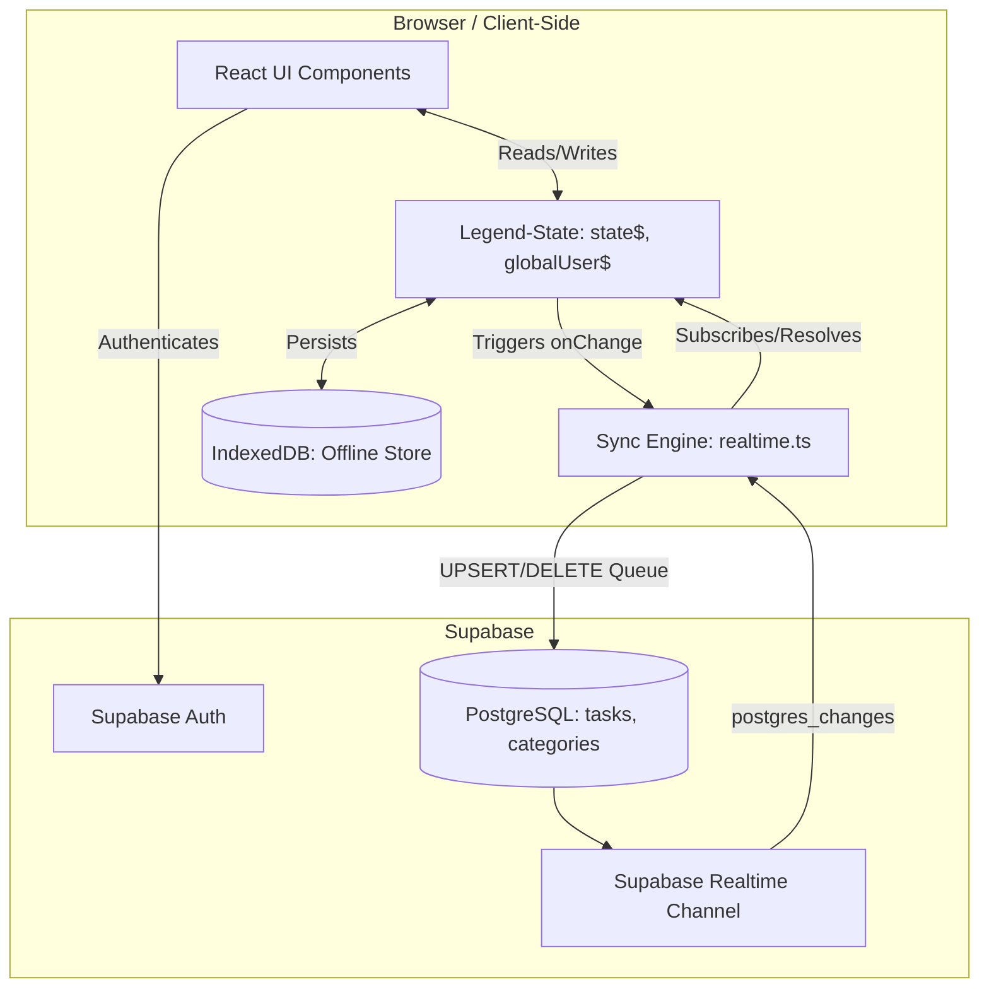

#### Sync Sequence Example


```mermaid
sequenceDiagram
    participant U as User / UI
    participant L as Legend-State
    participant IDB as IndexedDB (Offline)
    participant S as Sync Engine (realtime.ts)
    participant Supa as Supabase

    U->>L: Create or Edit Task
    L->>IDB: Persist automatically
    L->>S: onChange event triggered
    S->>S: Hash diff against knownTasks
    S->>S: Queue UPSERT/DELETE operation
    S->>S: Debounce 500ms

    alt is Online
        S->>Supa: Execute Supabase API (Upsert/Delete)
        Supa-->>S: Success response
        S->>S: Remove from syncQueue
        S->>L: Update queue state
    else is Offline
        S->>S: Halt processing
        S->>IDB: syncQueue remains persisted
    end

    Note over Supa,S: Remote changes from other devices
    Supa->>S: postgres_changes (INSERT/UPDATE/DELETE)
    S->>S: Check updated_at (Conflict Resolution)
    alt Remote is newer
        S->>S: Lock isApplyingRemoteChange = true
        S->>L: Update state with remote payload
        L->>IDB: Persist synced data
        S->>S: Update knownTasks cache
        S->>S: Unlock isApplyingRemoteChange
    else Local is newer
        S->>S: Discard remote change
    end