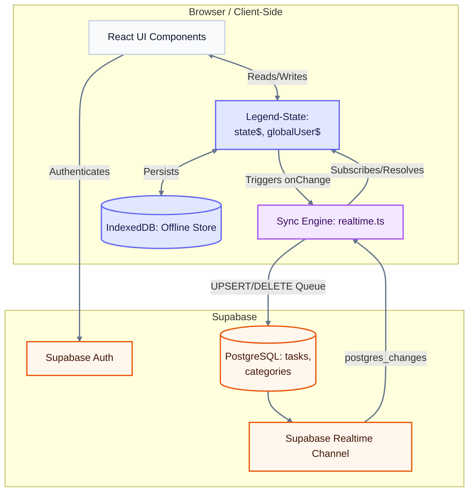
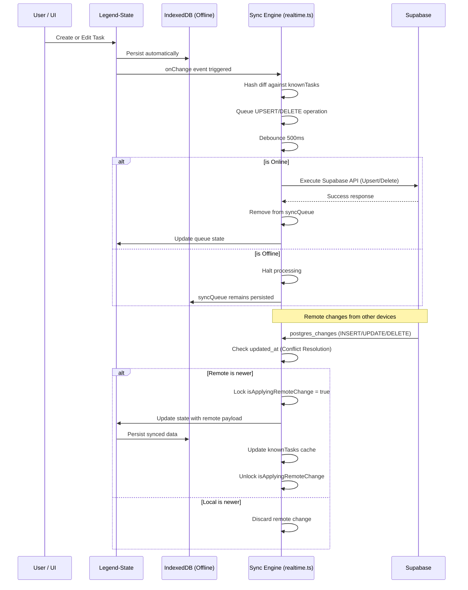

# System Architecture & Synchronization

This document outlines the architecture and data flow for the real-time, local-first task management application. The system is designed to provide immediate UI updates (optimistic rendering), full offline capabilities, and cross-device synchronization.

## System Architecture

The application employs a decoupled architecture where the React frontend never communicates directly with the database for standard operations. Instead, all UI components interface exclusively with a local reactive store, while a dedicated Sync Engine handles background synchronization.

### Core Components

* **React UI Components:** The presentation layer. Components subscribe to specific branches of the state and trigger mutations directly against the store. 
* **State Management (Legend-State):** The single source of truth (`state$`). It provides fine-grained reactivity, ensuring that only components listening to changed nodes will re-render.
* **Offline Persistence (IndexedDB):** Legend-State's persistence plugin automatically mirrors the in-memory state to IndexedDB, ensuring data is retained between sessions and during network outages.
* **Sync Engine (`realtime.ts`):** A custom middleman that bridges the local state and the remote database. It listens for state changes, manages an operational queue, and resolves incoming remote data.
* **Supabase Backend:** Provides authentication, PostgreSQL data storage, and WebSocket channels for broadcasting real-time changes to other connected clients.

---

## Synchronization Workflow

Because the application is local-first, the Sync Engine must manage network states, queue operations when offline, and resolve conflicts when multiple devices modify the same record simultaneously.

### Sync Sequence Example

### Workflow Phases

1. **Local Mutation & Hashing:**
   When a user modifies a task, the UI updates instantly. The Sync Engine detects the `onChange` event and generates a hash of the payload (excluding timestamps). By comparing this hash against a local cache (`knownTasks`), it prevents duplicate network requests if the state hasn't fundamentally changed.
   
2. **Queue Processing & Offline Support:**
   Valid mutations are added to a `syncQueue` and debounced for 500ms to batch rapid changes. 
   * **If Offline:** The network request is aborted. Because the `syncQueue` is stored inside Legend-State, the pending operations are safely persisted to IndexedDB. They remain queued until the browser fires an `online` event.
   * **If Online:** The engine executes the `UPSERT` or `DELETE` command via the Supabase REST API. Upon success, the operation is cleared from the queue.

3. **Inbound Sync & Conflict Resolution:**
   The application maintains an active WebSocket connection to Supabase. When a task is modified by another device, a `postgres_changes` payload is pushed to the client.
   * **Resolution:** The engine compares the incoming `updated_at` timestamp against the local record. If the local record is newer, the remote change is discarded.
   * **Mutex Lock:** If the remote change is accepted, a flag (`isApplyingRemoteChange`) is temporarily locked. This prevents the incoming data from accidentally triggering a new outgoing `onChange` event, avoiding an infinite synchronization loop.